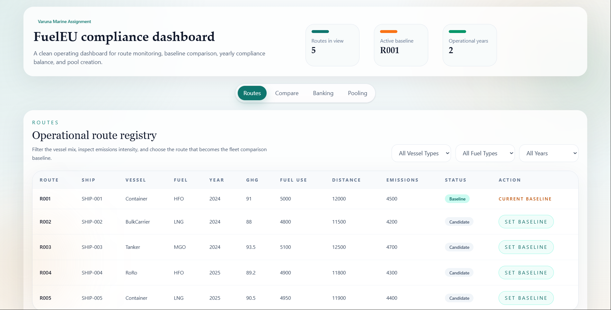
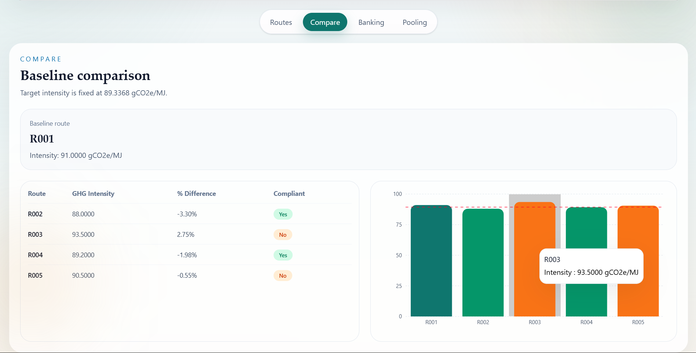
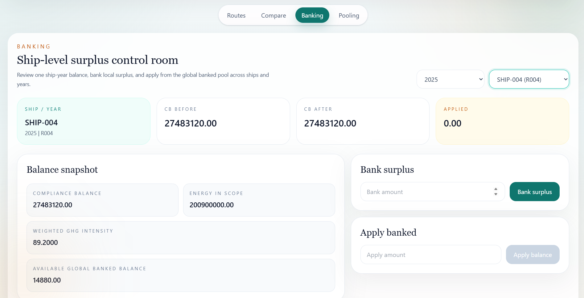
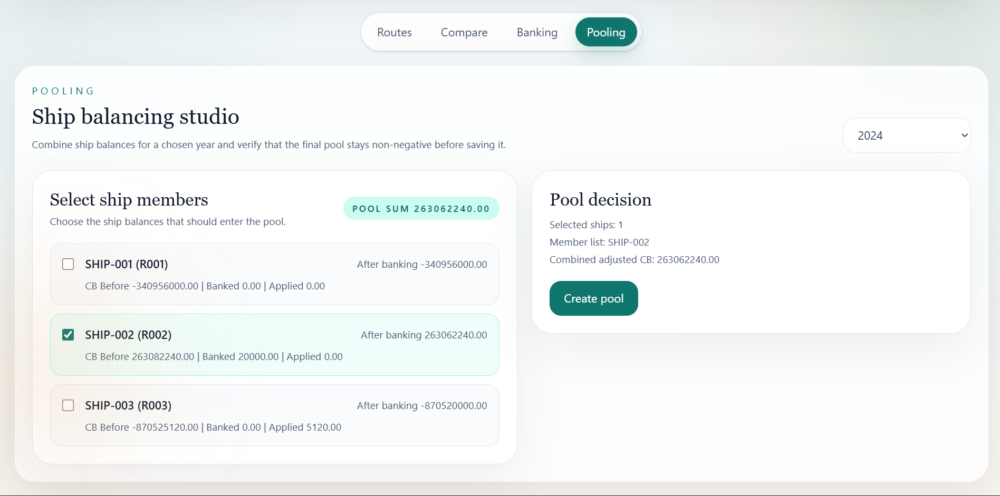

# FuelEU Maritime Compliance Dashboard

## Overview

This project is a full-stack FuelEU Maritime compliance module built for the assignment brief.

- `frontend/` contains a React + TypeScript + TailwindCSS dashboard
- `backend/` contains a Node.js + TypeScript + PostgreSQL API
- the app supports four tabs:
  - Routes
  - Compare
  - Banking
  - Pooling

The dashboard lets a user inspect seeded route data, select a baseline route, compare route intensities against the baseline, calculate ship-level compliance balance, bank surplus, apply banked surplus, and create valid compliance pools.

## Architecture

Both frontend and backend follow a hexagonal structure.

### Frontend

```text
frontend/src/
  core/
    domain/
    application/
    ports/
  adapters/
    ui/
    infrastructure/
```

- `core/` contains domain types, use-case services, and ports
- `adapters/ui/` contains React pages and UI components
- `adapters/infrastructure/` contains the HTTP gateway used by the frontend

### Backend

```text
backend/src/
  core/
    domain/
    application/
    ports/
  adapters/
    inbound/http/
    outbound/
  infrastructure/
```

- `core/` contains domain rules and application use-cases
- `adapters/inbound/http/` exposes Express routes
- `adapters/outbound/` contains PostgreSQL repository implementations
- `infrastructure/` contains database bootstrap and server startup

## Tech Stack

- Frontend: React, TypeScript, TailwindCSS, Vite, Recharts
- Backend: Node.js, TypeScript, Express, PostgreSQL
- Testing:
  - Backend: Vitest, Supertest
  - Frontend: Vitest, React Testing Library

## Features

### 1. Routes

- fetches all routes from `GET /routes`
- supports filtering by `vesselType`, `fuelType`, and `year`
- allows setting a baseline through `POST /routes/:routeId/baseline`

### 2. Compare

- fetches baseline comparison data from `GET /routes/comparison`
- calculates percentage difference using the assignment formula
- shows compliance status and a chart for GHG intensity comparison

### 3. Banking

- fetches ship-year compliance balance using `GET /compliance/cb?shipId&year`
- fetches banking records using `GET /banking/records?shipId&year`
- supports:
  - `POST /banking/bank`
  - `POST /banking/apply`
- shows `cb_before`, `applied`, and `cb_after`
- supports a global available banked balance across ships and years

### 4. Pooling

- fetches adjusted compliance balances using `GET /compliance/adjusted-cb?year`
- creates pools using `POST /pools`
- validates:
  - total adjusted CB must be non-negative
  - deficit ships cannot exit worse
  - surplus ships cannot exit negative

## Live Demo

To avoid local setup, you can review the deployed version first.

* Frontend: [https://emissions-tracking-platform.vercel.app/](https://emissions-tracking-platform.vercel.app/)
* Backend API: [https://emissions-tracking-platform.onrender.com](https://emissions-tracking-platform.onrender.com)

> ⚠️ Note: The backend is hosted on Render (free tier). It may take **40–60 seconds** to respond on the first request due to server cold start (spin-up time). Subsequent requests will be faster.


If the deployed environment is enough for your review, you can use that directly. The local setup steps below are only needed if you want to run the project on your own machine.

## Setup

### Prerequisites

- Node.js 20+
- npm
- PostgreSQL connection string
- Supabase Postgres database

### 1. Clone and install

```bash
git clone https://github.com/Jenil1105/emissions-tracking-platform.git
cd emissions-tracking-platform
cd backend && npm install
cd ../frontend && npm install
```

### 2. Configure backend database connection

Create [backend/.env](D:/emissions-tracking-platform/backend/.env) with:

```env
DATABASE_URL=your_postgres_connection_string
```

If you are using Supabase:

1. Open your Supabase project
2. Go to `Settings -> Database`
3. Copy the connection string
4. Paste it into `backend/.env` as `DATABASE_URL`

Example format:

```env
DATABASE_URL=postgresql://postgres:<password>@<host>:6543/postgres?sslmode=require
```

Notes:

- the backend reads `DATABASE_URL` from [backend/src/infrastructure/db.ts](D:/emissions-tracking-platform/backend/src/infrastructure/db.ts)
- on startup, the backend creates/upgrades tables and seeds route data automatically through [backend/src/infrastructure/initDatabase.ts](D:/emissions-tracking-platform/backend/src/infrastructure/initDatabase.ts)

### 3. Run the backend

```bash
cd backend
npm run dev
```

Backend runs at:

```text
http://localhost:3000
```

### 4. Run the frontend

```bash
cd frontend
npm run dev
```

Frontend runs at:

```text
http://localhost:5173
```

The frontend API gateway is currently configured to call `http://localhost:3000` in [frontend/src/adapters/infrastructure/HttpRouteGateway.ts](D:/emissions-tracking-platform/frontend/src/adapters/infrastructure/HttpRouteGateway.ts).

## Tests

### Backend tests

```bash
cd backend
npm test
```

Covers:

- unit tests for compliance, comparison, banking, and pooling use-cases
- integration tests for Express endpoints using Supertest
- data bootstrap checks for table creation, upgrade logic, and route seeding

### Frontend tests

```bash
cd frontend
npm test
```

Covers:

- frontend service/use-case delegation
- Routes tab component behavior
- Compare tab rendering
- Banking tab interaction states
- Pooling tab validation states


## Sample API Requests / Responses

### `GET /routes`

Request:

```http
GET http://localhost:3000/routes
```

Sample response:

```json
[
  {
    "id": 1,
    "routeId": "R001",
    "shipId": "SHIP-001",
    "vesselType": "Container",
    "fuelType": "HFO",
    "year": 2024,
    "ghgIntensity": 91,
    "fuelConsumption": 5000,
    "distance": 12000,
    "totalEmissions": 4500,
    "isBaseline": true
  },
  {
    "id": 2,
    "routeId": "R002",
    "shipId": "SHIP-002",
    "vesselType": "BulkCarrier",
    "fuelType": "LNG",
    "year": 2024,
    "ghgIntensity": 88,
    "fuelConsumption": 4800,
    "distance": 11500,
    "totalEmissions": 4200,
    "isBaseline": false
  }
]
```

### `GET /compliance/cb?shipId=SHIP-002&year=2024`

Request:

```http
GET http://localhost:3000/compliance/cb?shipId=SHIP-002&year=2024
```

Sample response:

```json
{
  "shipId": "SHIP-002",
  "routeId": "R002",
  "year": 2024,
  "ghgIntensity": 88,
  "energyInScope": 196800000,
  "complianceBalance": 263082240,
  "cbBefore": 263082240
}
```

## Screenshots


### Routes Tab



### Compare Tab



### Banking Tab



### Pooling Tab


